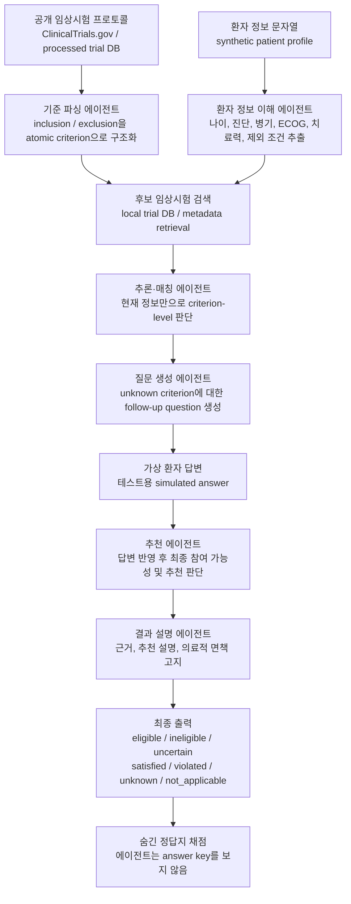

# Health Agent

Healthcare Agentic AI Challenge 2026 대응용 멀티 에이전트 임상시험 적합도 사전심사 시스템입니다.

이 저장소의 목표는 단순한 질의응답 챗봇이나 돈벌이 임상시험 추천기가 아니라, **질환 또는 임상적 문제가 있는 환자에게 관련 임상시험 후보를 사전 탐색하고, 공개 임상시험 프로토콜의 inclusion/exclusion 기준과 환자 정보를 비교하여 참여 가능성·부족 정보·추천 우선순위를 근거와 함께 제시하는 재현 가능한 agentic workflow**를 만드는 것입니다.

## 1. 상황 정의

이 프로젝트의 기본 시나리오는 다음과 같습니다.

```text
환자 또는 의료진이 특정 질환/증상/검사 결과를 가진 환자에게
적절한 치료를 제공할 수 있는 관련 임상시험 후보가 있는지 사전 탐색한다.
시스템은 공개 trial protocol과 환자 정보를 비교해
eligible / ineligible / uncertain 상태를 근거와 함께 제시하고,
판단에 필요한 정보가 부족하면 follow-up question을 생성한다.
```

따라서 이 프로젝트의 정확한 문제 정의는 다음에 가깝습니다.

```text
Clinical trial pre-screening / patient-trial matching assistant
= 환자-임상시험 적합도 사전심사 보조 시스템
```

예를 들어 `68세 남성, 장기 흡연력, 무통성 혈뇨, CT상 방광벽 종괴`라는 환자 정보가 주어졌다면, 시스템은 보상금이 높은 건강자원자 trial을 찾는 것이 아니라 다음을 수행해야 합니다.

```text
1. bladder cancer / urothelial carcinoma 관련 trial을 찾는다.
2. trial의 inclusion/exclusion 기준을 atomic criterion으로 나눈다.
3. 환자의 나이, 성별, 의심 진단, 병리 확진 여부, 병기, ECOG, 신장기능, 이전 치료력을 비교한다.
4. 부족한 정보가 있으면 질문한다.
5. 현재 정보만으로 eligible / ineligible / uncertain을 판단한다.
6. 여러 후보 trial을 근거 기반으로 순위화한다.
```

## 2. 대회 요약

대회 주제는 **Interactive Clinical Trial Recommendation**입니다.

입력은 다음 두 축입니다.

1. ClinicalTrials.gov 등 공개 임상시험 프로토콜
   - inclusion criteria
   - exclusion criteria
   - description / brief summary
   - condition, intervention, phase 등 metadata
2. 환자 프로파일
   - 나이, 성별, 병력, 증상, 검사 결과, 투약, 과거 치료력 등
   - 공식 예시는 `data/raw/synthetic-patients.json`의 10개 synthetic topic
   - oncology 개발 fixture는 `data/raw/oncology-synthetic-patients.json`

최종 출력은 다음을 포함해야 합니다.

1. 임상시험 참여 가능성 판정
   - `eligible`
   - `ineligible`
   - `uncertain`
2. criterion-level 판단 근거
   - `satisfied`
   - `violated`
   - `unknown`
   - `not_applicable`
3. 부족 정보에 대한 follow-up question
4. 환자별 임상시험 추천 순위와 설명
5. 의료적 면책 고지

평가 비중은 매칭 정확성 30%, 랩 내 정성 평가 30%, 발표 점수 40%로 본다. 따라서 단순 accuracy만이 아니라, 에이전트 구성, 오케스트레이션, 근거 제시, 오류 분석, 발표 가능성이 중요합니다.

## 3. 핵심 설계 원칙

이 프로젝트는 LLM 하나에 모든 판단을 맡기지 않습니다.

```text
자연어 이해와 애매한 의미 판단  -> LLM agent
명시적 수치, 성별, 나이, 기간 조건 -> Python validator
후보 trial 검색                    -> retrieval / metadata filter
충돌 및 hard case                  -> 상위 model adjudicator
최종 출력                           -> schema-validated report
```

LLM은 classifier 자체라기보다, 임상시험 기준과 환자 정보를 구조화하고 애매한 의미 판단을 보조하는 semantic module로 사용합니다.

## 4. 전체 아키텍처



위 다이어그램은 현재 Solar Pro 3 `multi-agent` 데모의 실제 실행 구조와
같다. 환자 1명당 Solar API를 정확히 6회 호출하며, 각 호출은 다음 역할을
맡는다.

1. `criteria_parser_agent`
2. `patient_information_understanding_agent`
3. `inference_matching_agent_initial`
4. `question_generation_agent`
5. `recommendation_agent`
6. `result_explanation_agent`

핵심은 질문 루프를 분리한 것이다. `initial_assessment`는 부족 정보가
아직 없는 상태의 1차 판단이고, `follow_up_questions`와
`simulated_patient_answers` 뒤의 `final_assessment_after_answers`는
그 답변을 반영한 2차 판단이다.

## 5. 에이전트 역할

| Agent | 역할 | 1차 구현 | 이후 확장 |
|---|---|---|---|
| `trial_criteria_parser` | inclusion/exclusion을 atomic rule로 분해 | deterministic / fixture | Solar Pro 3 |
| `patient_profiler` | vignette에서 핵심 환자 정보 추출 | JSON loader | Solar Pro 3 |
| `candidate_trial_retriever` | 환자별 후보 trial top-k 검색 | metadata filter | BM25 + vector retrieval |
| `eligibility_matcher` | criterion별 satisfied/violated/unknown 판정 | rule scorer | Solar Pro 3 |
| `python_rule_validator` | 나이, 성별, 수치, 기간 조건 검증 | Python | 강화 |
| `conflict_adjudicator` | 불일치, low-confidence, exclusion conflict 판정 | stub | GLM-class model |
| `missing_info_question_generator` | unknown criterion 질문 생성 | template | Solar Pro 3 |
| `trial_ranker` | 환자별 trial ranking | score formula | learning-to-rank / LLM explanation |
| `final_explainer` | 최종 보고서 생성 | template | Solar Pro 3 |

## 6. 모델 운영 전략

현재 자원 가정:

- Solar Pro 3: 무제한 또는 사실상 무제한 사용 가능
- K-EXAONE: legacy smoke path only
- GLM급 모델: 상위 adjudicator로 유료 사용
- GPT / Claude: 필요 시 hard-case spot check만 사용

권장 라우팅:

```text
Solar Pro 3
  - primary worker model
  - trial criteria parsing
  - patient profiling
  - first-pass eligibility matching
  - semantic clinical context 판단
  - native function calling으로 local trial DB 조회
  - JSON repair
  - question generation
  - explanation draft

GLM-class model
  - hard case adjudication
  - exclusion conflict
  - Solar vs deterministic baseline disagreement
  - low confidence cases

Python
  - deterministic validator
  - numeric threshold check
  - age / sex / time-window logic
  - final aggregation
```

GLM으로 올리는 조건:

```python
should_escalate = (
    confidence < 0.75
    or solar_disagrees_with_rule_baseline
    or has_exclusion_conflict
    or evidence_span_missing
    or unknown_count_is_high
    or top1_top2_ranking_margin_is_small
    or high_risk_domain_involved
)
```

`high_risk_domain_involved` 예시:

- oncology
- biomarker
- line of therapy
- pregnancy
- renal function
- hepatic function
- immunosuppression
- recent infection
- numeric laboratory threshold

## 7. 데이터 전략

### 사용 가능한 데이터

- 공개 ClinicalTrials.gov protocol text
- 제공 synthetic patient example 10건
- 추가 synthetic patient / trial-pair data 생성 가능

### 금지 또는 주의

- 개인식별정보 사용 금지
- 비공개 의료정보 사용 금지
- 모든 데이터 출처와 라이선스 명시 필요
- 모델 생성 label은 gold label이 아니라 silver label로 취급

### 목표 데이터 규모

초기 목표:

```text
trials: 50-150
synthetic patients: 100-500
retrieved patient-trial pairs: 1,000-5,000
criterion-level silver labels: 5,000+
human-reviewed gold pairs: 100-300
```

수상권 목표:

```text
trials: 150-300+
synthetic patients: 500-2,000+
retrieved patient-trial pairs: 5,000-20,000+
criterion-level silver labels: 50,000+
human-reviewed gold pairs: 300-700
```

중요한 것은 단순 개수가 아니라 coverage입니다.

Coverage 축:

- demographics: age, sex, pregnancy
- diagnosis: confirmed vs suspected disease
- severity: stage, ECOG, NYHA, fibrosis grade 등
- labs: numeric and qualitative findings
- medication: current and prior medication
- procedure: surgery, biopsy, transplant 등
- temporal criteria: within 14 days, prior 6 months 등
- exclusion: infection, pregnancy, organ dysfunction, prior malignancy 등
- missing information: unknown을 질문으로 바꾸는 케이스

## 8. 내부 스키마 원칙

모든 중간 산출물은 Pydantic schema를 통과해야 합니다.

예상 criterion result:

```json
{
  "criterion_id": "NCT00000000-I-001",
  "criterion_type": "inclusion",
  "status": "satisfied",
  "confidence": 0.91,
  "trial_evidence": "Age 18 years or older",
  "patient_evidence": "54-year-old man",
  "reason": "The patient is older than 18."
}
```

예상 trial-level result:

```json
{
  "patient_id": "S001",
  "trial_id": "NCT00000000",
  "overall_status": "uncertain",
  "recommendation_score": 0.72,
  "criteria_results": [],
  "missing_questions": [],
  "rationale": "..."
}
```

Aggregation policy:

```text
exclusion violated       -> ineligible
required inclusion missed -> ineligible or uncertain
required information missing -> uncertain
all required inclusion satisfied and no exclusion violated -> eligible
```

## 9. 개발 로드맵

### Phase 0. 저장소 정리

- README, AGENTS, CODEX, TASKS를 사람이 읽을 수 있게 유지한다.
- 실행 진입점과 테스트 진입점을 명확히 둔다.
- 원본 데이터는 `data/raw/`에 보관한다.

### Phase 1. Deterministic baseline

목표: LLM 없이도 끝까지 도는 baseline.

작업:

1. `data/raw/synthetic-patients.json` 및 oncology fixture loader 완성
2. `data/raw/sample-trials.json` loader 완성
3. trial / patient / criterion / result Pydantic schema 고정
4. deterministic eligibility scorer 구현
5. missing information question template 구현
6. `scripts/run_demo.py`로 end-to-end demo 출력
7. unittest 통과

성공 기준:

```bash
python scripts/run_demo.py --limit 3
python -m unittest discover -s tests
```

### Phase 2. Trial ingestion

목표: ClinicalTrials.gov protocol을 가져와 내부 trial schema로 변환.

작업:

1. ClinicalTrials.gov API 또는 다운로드 파일 ingestion
2. NCT ID, condition, intervention, phase, status metadata 저장
3. inclusion/exclusion raw text 저장
4. criterion ID 생성
5. 데이터 출처와 라이선스 기록

산출물:

```text
data/processed/trials.jsonl
data/processed/criteria.jsonl
DATA_SOURCES.md
```

### Phase 3. Retrieval

목표: 모든 patient-trial pair를 brute force하지 않고 후보 trial만 고른다.

작업:

1. condition / keyword 기반 metadata filter
2. BM25 baseline
3. optional embedding retrieval
4. 환자별 top-k trial candidate 생성
5. retrieval recall@k 평가

산출물:

```text
outputs/retrieval_candidates.jsonl
```

### Phase 4. LLM worker integration

목표: Solar Pro 3 native function calling을 provider-neutral interface 뒤에 붙인다.

작업:

1. `src/hc_agent/llm.py`에 provider abstraction 구현
2. `configs/models.yaml`로 model routing 관리
3. structured output validation
4. retry / repair loop 구현
5. token usage와 latency logging

초기 agent routing:

```text
criteria parser: Solar Pro 3
patient profiler: Solar Pro 3
question generator: Solar Pro 3
explanation generator: Solar Pro 3
format repair: Solar Pro 3
```

### Phase 5. Matching and adjudication

목표: core eligibility matching 성능 개선.

작업:

1. Solar Pro 3 first-pass matcher with local DB tools
2. Python rule validator 적용
3. disagreement detector
4. GLM escalation
5. final aggregation policy 고정

Hard case 조건:

```text
low confidence
exclusion conflict
missing evidence
unknown count high
high-risk domain
ranking tie
```

### Phase 6. Evaluation

목표: 개선 여부를 숫자로 확인한다.

Metric:

- criterion status accuracy
- exclusion violation recall
- unknown detection F1
- evidence presence / grounding proxy
- question coverage
- trial ranking recall@k
- cost per patient
- latency per patient

Ablation:

- deterministic baseline
- Solar only
- Solar + Python validator
- Solar native tools vs inline prompt
- GLM adjudication on hard cases
- retrieval top-k variants

### Phase 7. Final demo and presentation

목표: 평가자에게 구조와 성능을 설득한다.

발표 구성:

1. Problem definition
2. Agent architecture
3. Data and schema design
4. Retrieval design
5. Eligibility matching logic
6. Missing information question loop
7. Model routing and cost control
8. Evaluation results
9. Error analysis
10. Demo cases
11. Limitations and medical disclaimer
12. Conclusion

## 10. Repository layout

```text
README.md
AGENTS.md
CODEX.md
CODEX_BOOTSTRAP_PROMPT.md
TASKS.md
DATA_SOURCES.md
LICENSE_NOTES.md
MEDICAL_DISCLAIMER.md
pyproject.toml
configs/
  models.yaml
  pipeline.yaml
data/
  raw/
  processed/
docs/
  architecture.md
  evaluation.md
  model_strategy.md
  project_plan.md
scripts/
  run_demo.py
  inspect_sample_patients.py
src/
  hc_agent/
    schemas.py
    config.py
    llm.py
    graph.py
    nodes/
    retrieval/
    eval/
tests/
```

## 11. Quick start

```bash
python -m venv .venv
source .venv/bin/activate
python scripts/run_demo.py --limit 3
python -m unittest discover -s tests
```

설치형 프로젝트로 정리한 뒤에는 다음을 사용한다.

```bash
pip install -e .
health-agent-demo --limit 3
health-agent-llm-eval --dry-run --max-patients 2 --top-k 2
```

추가 로컬 검증:

```bash
python -m unittest discover -s tests
python scripts/run_demo.py --limit 3
python scripts/run_llm_eval.py --dry-run --max-patients 2 --top-k 2
```

## 12. Solar Pro 3 / Upstage Evaluation

LLM evaluation path는 선택 기능이며, API key는 저장소에 넣지 않는다. OS environment 또는 로컬 `.env` 파일에서만 읽는다.

Required environment variables:

- `UPSTAGE_API_KEY`, or fallback `SOLAR_API_KEY`

Optional variables:

- `SOLAR_MODEL`, default `solar-pro3`
- `UPSTAGE_BASE_URL` / `SOLAR_BASE_URL`, default `https://api.upstage.ai/v1`
- `UPSTAGE_CHAT_COMPLETIONS_URL` / `SOLAR_CHAT_COMPLETIONS_URL`

Solar Pro 3 E2E runner는 숨긴 정답지를 받지 않는다. 기본 `multi-agent`
모드는 환자 1명당 Solar API를 6회 호출해 기준 파싱, 환자 정보 이해,
초기 매칭, 질문/가상 답변 생성, 최종 추천, 결과 설명을 단계별로 수행한다.
`tool`과 `inline`은 단일 Solar 호출 비교군이다. 실제 API 호출은 명시
플래그 없이는 실행되지 않는다. 3명을 초과하는 live run은 추가로
`--confirm-full-hidden-eval`이 필요하다.

출력은 두 단계 판단을 분리한다. `initial_assessment`는 부족 정보가 아직
없는 상태의 판단이고, `follow_up_questions`와 `simulated_patient_answers`
뒤의 `final_assessment_after_answers`는 그 답변을 반영한 재판단이다.

```powershell
python scripts\run_solar_e2e_orchestration.py `
  --env-file "<path-to-local-env-file>" `
  --mode multi-agent `
  --max-patients 3 `
  --concurrency 1 `
  --confirm-live-solar-api
```

결과 채점:

```powershell
python scripts\evaluate_hidden_e2e_predictions.py `
  --predictions outputs\solar_e2e_predictions.jsonl `
  --output outputs\solar_e2e_hidden_eval_report.json `
  --fail-on-contract-errors
```

100명 데모 실행 예:

```powershell
python scripts\run_solar_e2e_orchestration.py `
  --env-file ".env" `
  --mode multi-agent `
  --concurrency 4 `
  --confirm-live-solar-api `
  --confirm-full-hidden-eval `
  --output-jsonl outputs\solar_e2e_multi_agent_full_100.jsonl `
  --output-json outputs\solar_e2e_multi_agent_full_100.json `
  --summary outputs\solar_e2e_multi_agent_full_100.summary.json `
  --raw-output-jsonl outputs\solar_e2e_multi_agent_full_100.raw.jsonl `
  --audit-output-jsonl outputs\solar_e2e_multi_agent_full_100.audit.jsonl `
  --manifest outputs\solar_e2e_multi_agent_full_100.manifest.json
```

2026-07-08 로컬 live run 데모 결과:

| 항목 | 결과 |
|---|---:|
| synthetic patients | 100 |
| candidate trial judgments | 500 |
| Solar API calls | 600 |
| API success rate | 100% |
| JSON parse success rate | 100% |
| contract errors | 0 |
| follow-up questions | 580 |
| simulated patient answers | 580 |
| eligibility accuracy vs hidden silver labels | 84.0% |
| criterion status accuracy vs hidden silver labels | 73.21% |
| exact recommendation-set match | 55.0% |

이 점수는 합성 데이터와 hidden silver label 기준의 소프트웨어 벤치마크다.
의학적 ground truth나 실제 임상 적합성 판정으로 해석하지 않는다.

Legacy `scripts/run_llm_eval.py`는 Friendli/K-EXAONE smoke path로 남아 있지만,
대회 포맷 E2E hidden evaluation은 Solar Pro 3 runner를 사용한다.

## 13. Codex 작업 순서

Codex는 다음 순서로 읽고 작업한다.

1. `README.md`
2. `AGENTS.md`
3. `CODEX.md`
4. `TASKS.md`
5. `src/hc_agent/schemas.py`
6. `scripts/run_demo.py`
7. `tests/`

첫 작업은 다음이다.

```text
1. 현재 테스트를 실행한다.
2. 깨지는 테스트가 있으면 스키마 또는 import path부터 고친다.
3. README의 Phase 1 항목을 기준으로 deterministic baseline을 완성한다.
4. 그 다음 ClinicalTrials.gov ingestion stub을 구현한다.
```

## 14. Medical disclaimer

이 프로젝트의 출력은 연구 및 참고용이며, 의학적 자문이나 실제 임상 의사결정으로 사용해서는 안 된다. 실제 환자 진료, 임상시험 등록, 치료 결정에는 반드시 자격 있는 의료 전문가와 공식 임상시험 담당자의 판단이 필요하다.
